# Logos for 89 stations, 2026-09-29

89 stations that showed the default icon get their logo; 8 stations still have none. With this, 221 of the 229 stations have a logo.

**Merge after the app releases that load logos from Pages** (RoRadio after 2.0.1 on Windows, after 1.6.x on Xbox). The released apps look for a logo only in their own package, so a logo file they do not bundle shows as an empty tile there instead of the default icon. The new apps bundle `RadioLogos/` and load any logo they do not bundle from `https://ventura8.github.io/RoRadioResources/RadioLogos/<file>`.

Each logo was tied to the station by more than its name - the stream's `icy-name` or `icy-url`, the broadcaster's own site or player, the same stream url in a directory, a frequency or a town - and looked at on a contact sheet. All are PNG, at most 400 px on the longest side and under 80 KB.

## Added

| Logo | Station | File | Source | How it was identified |
| :---: | :--- | :--- | :--- | :--- |
| 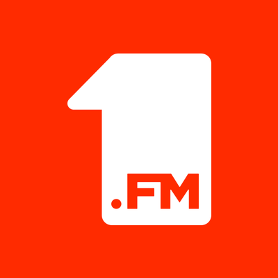 | 1.FM Euro 80's | `1-fm-euro-80s.png` | [cdn-radiotime-logos.tunein.com/s74983g.png](http://cdn-radiotime-logos.tunein.com/s74983g.png) | icy-name "1.FM Euro 80's" (80s 90s is now 1.FM Euro 80's); TuneIn "1.FM - All Euro 80's Radio" logo. |
| 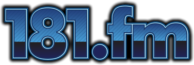 | 181 FM | `181-fm.png` | [cdn-radiotime-logos.tunein.com/s90414g.png](http://cdn-radiotime-logos.tunein.com/s90414g.png) | icy-name "181.FM Lite 90s"; TuneIn "181.FM Lite 90's" logo (181.fm brand). |
|  | 1Mix Radio | `1mix-radio.png` | [www.1mix.co.uk/forum/styles/acidtech/theme/images/site_logo.gif](https://www.1mix.co.uk/forum/styles/acidtech/theme/images/site_logo.gif) | icy-name "1Mix Radio Trance Stream", icy-url 1mix.co.uk (site returns 403). The 1Mix Radio logo radio-browser lists for 1Mix, 171x90 upscaled 2x. |
|  | 90er Stream | `90er-stream.png` | [assets.laut.fm/467e9a7ae5bb926c3c0401c4495042c2?t=_640x640](https://assets.laut.fm/467e9a7ae5bb926c3c0401c4495042c2?t=_640x640) | icy-name "90er", icy-url laut.fm/90er; og:image of the laut.fm station page. |
|  | ALT FM Arad | `alt-fm-arad.png` | `https://www.altfm.ro/assets/site/images/logo/altfm.svg` (from `https://www.altfm.ro/`) | Radio CNM now broadcasts as ALT FM Arad: stream altfm.faur.cc/alt_fm_256; onlineradiobox "ALT FM" streams altfm.faur.cc/alt_fm_128. Logo is the SVG header logo of altfm.ro, rendered to PNG. |
| 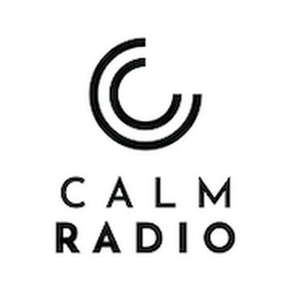 | CALM RADIO | `calm-radio.png` | [calmradio.com/templates/calmradio/favicons/apple-touch-icon.png](https://calmradio.com/templates/calmradio/favicons/apple-touch-icon.png) | icy-name "CALMRADIO.COM - Soul Classics", streams.calmradio.com; Calm Radio apple-touch-icon (180 upscaled 2x). |
| 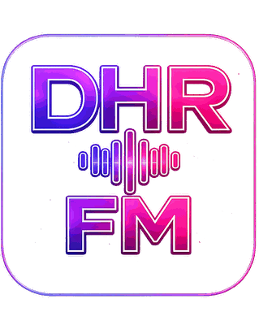 | DHR FM | `dhr-fm.png` | `https://www.dhr.fm/favicon.png` (from `https://www.dhr.fm`) | Radio Hit Romania now broadcasts as DHR FM (icy-name "DHR FM - Deep House Radio (`www.dhr.fm`)"); the site icon is the DHR FM logo. |
|  | Dream FM | `dream-fm.png` | `https://cdn.onlineradiobox.com/img/l/7/19997.v4.png` (from `https://onlineradiobox.com/ro/dream/`) | Stream icy-name "Dream FM - For The Love Of Music", icy-url DreamFM.ro (site returns 404); onlineradiobox "Dream FM" streams exactly dreamfm.dtech.ro:9220/dreamfm. Small source (160x85, upscaled 2x). |
| 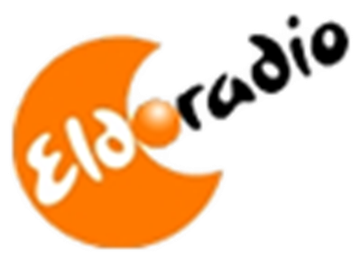 | Eldoradio 90's | `eldoradio-90s.png` | [cdn-radiotime-logos.tunein.com/s15159g.png](http://cdn-radiotime-logos.tunein.com/s15159g.png) | shoutcast.rtl.lu/eldo90s redirects to sc.bce.lu/eldo90s, icy-name "ELDORADIO - 90's Channel", icy-url eldo.lu. Eldoradio brand logo from TuneIn (eldo.lu only has a 115 px version of the same logo). |
|  | Fun fm | `fun-fm.png` | `https://funfm.ro/logo.png` (from `https://funfm.ro`) | Stream icy-name "FunFM", icy-url funfm.ro; logo from the station site (FUN 87.5 FM). |
|  | Funstudio DanceRadio | `funstudio-danceradio.png` | [funstudio.de/wp-content/uploads/2021/08/Funstudio1600x1600x300schwarz-1024x1024.jpg](https://funstudio.de/wp-content/uploads/2021/08/Funstudio1600x1600x300schwarz-1024x1024.jpg) | icy-name "Funstudio Danceradio", icy-url funstudio.de; og:image of the station site. |
| 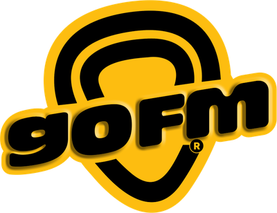 | goFM | `gofm.png` | [play.gofm.ro/logo-gofm.PNG](https://play.gofm.ro/logo-gofm.PNG) | icy-name "goFM.ro": Radio indiGo now broadcasts as goFM (Sibiu). Logo from the station's player site play.gofm.ro (`www.gofm.ro` redirects there). |
| 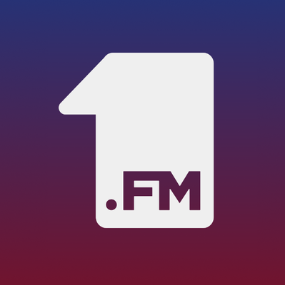 | jamz | `jamz.png` | [cdn-profiles.tunein.com/s47722/images/logog.png](http://cdn-profiles.tunein.com/s47722/images/logog.png) | icy-name "1.FM Top Rap" (strm112.1.fm/jamz); TuneIn "1.FM Top Rap" logo. |
|  | Jazz & Chill | `jazz-chill.png` | [jazzchill.es/imagenes/jazzchillFacebook1.jpg](https://jazzchill.es/imagenes/jazzchillFacebook1.jpg) | icy-name "Jazz & Chill", icy-url jazzchill.com (redirects to jazzchill.es); og:image of the station site. radio-browser lists this stream as "JAZZ & CHILL". |
| 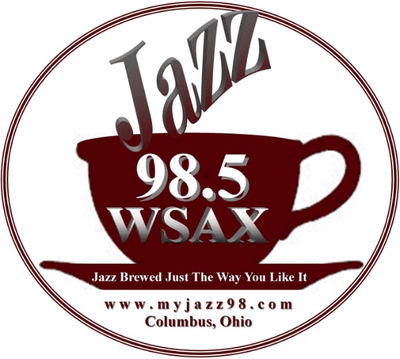 | Jazz 98.5FM WSAX | `jazz-98-5fm-wsax.png` | [cdn-profiles.tunein.com/s261751/images/logog.jpg](http://cdn-profiles.tunein.com/s261751/images/logog.jpg) | icy-name "WSAX-FM"; TuneIn "Jazz 98.5 FM" logo (WSAX, myjazz98.com, Columbus Ohio). |
|  | Jurnal FM | `jurnal-fm.png` | `https://jurnalfm.md/wp-content/uploads/2020/08/JFM-LOGO.png` (from `https://jurnalfm.md/`) | Stream audio.jurnalfm.md, icy-url jurnalfm.md (Chisinau); site logo (radio-browser uses it for this url). |
| 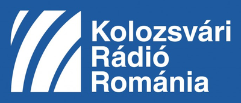 | Kolozsvári Rádió | `kolozsvari-radio.png` | [www.kolozsvariradio.ro/wp-content/uploads/2023/08/logo.jpg](https://www.kolozsvariradio.ro/wp-content/uploads/2023/08/logo.jpg) | Stream 89.238.227.6:8386 is listed on radio-browser as Kolozsvari Radio (kolozsvariradio.ro, SRR). og:image of the station site. |
| 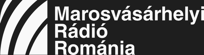 | Marosvásárhelyi Rádió | `marosvasarhelyi-radio.png` | `https://www.marosvasarhelyiradio.ro/wp-content/uploads/2026/05/reg_tg_mures__hu-logo__wh.svg` (from `https://www.marosvasarhelyiradio.ro/`) | Stream streaming.radiomures.ro:8312, icy-name "Radio Mures Maghiara" (Radio Romania Targu Mures, Hungarian); site header logo (white SVG, 2026) rendered on a dark background. |
| 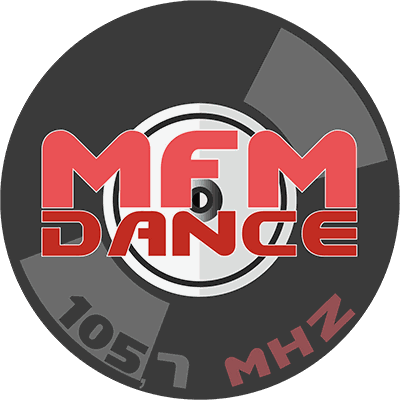 | MFM Dance | `mfm-dance.png` | `https://mfmdance.ro/data/uploads/logo-mfmdance.png` (from `https://mfmdance.ro/`) | Muntenia FM now broadcasts as MFM Dance (icy-name "MFMDANCE 105.7FM ROMANIA", icy-url mfmdance.ro; site title "MFM DANCE - Muntenia FM"). Square logo from the site (also the radio-browser favicon). |
|  | Ortodox Radio | `ortodox-radio.png` | `https://www.ortodoxradio.ro/images/logo.svg` (from `https://www.ortodoxradio.ro/`) | Stream host ortodoxradio.ro, icy-name "Orthodox Radio"; site header SVG wordmark "ortodoxradio" rendered to PNG (wide; the only other image is an icon of Christ without the name). |
| 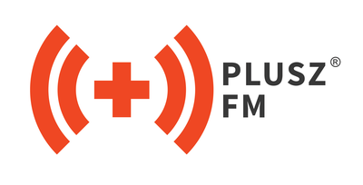 | Plusz FM | `plusz-fm.png` | `http://pluszfm.ro/images/plusz/pluszfm.jpg` (from `https://pluszfm.ro/`) | Stream stream2.radiotransilvania.ro/Nagyvarad, icy-description "Plusz FM"; radio-browser maps it to Plusz FM Nagyvarad (pluszfm.ro); og:image logo. |
|  | Pure Jazz Radio | `pure-jazz-radio.png` | [cdn-radiotime-logos.tunein.com/s106092g.png](http://cdn-radiotime-logos.tunein.com/s106092g.png) | radio-browser lists this exact stream (71.125.12.37:8000) as Pure Jazz Radio, purejazzradio.org; the site has no logo image, so the TuneIn "Pure Jazz Radio" logo (225 px) is used. |
|  | Radio 1 | `radio-1.png` | `https://cdn.onlineradiobox.com/img/l/5/65075.v9.png` (from `https://onlineradiobox.com/ro/1manele/`) | Stream icy-name "RADIO 1 MANELE ROMANIA - `wWw.RadioUnuManele.CoM`"; radiounumanele.com is now an unrelated site. onlineradiobox "Radio 1 Manele" streams ssl.omegahost.ro/8000, which carries the same icy-name and the same song at the same time. Small source (160x85, upscaled 2x). |
| 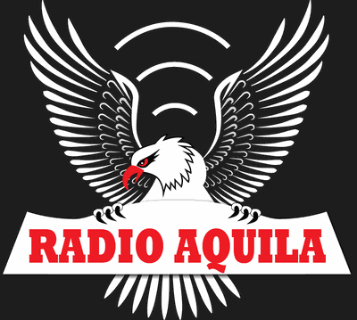 | Radio Aquila | `radio-aquila.png` | `https://radioaquila.ro/wp-content/uploads/2026/05/logo_RA_alb876x780.png` (from `https://radioaquila.ro/`) | Stream icy-name "Radio Aquila", icy-url radio-aquila.ro (redirects to radioaquila.ro); site logo has white wings, placed on a dark background to stay readable. |
| 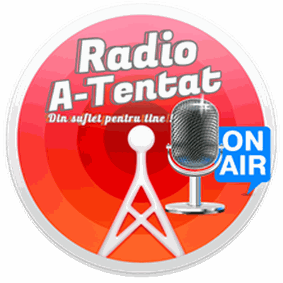 | Radio Atentat | `radio-atentat.png` | `https://atentat.ro/wp-content/uploads/2021/03/radio240.png` (from `https://atentat.ro/`) | Stream icy-name "Radio A-tentat", icy-url atentat.ro; logo is the site icon (radio-browser uses the same). |
|  | Radio B Zone | `radio-b-zone.png` | `https://res.b-zone.ro/ll/actual.jpg` (from `https://b-zone.ro/`) | Stream bzone.radioca.st, icy-name "SC B-ZONE.RO SRL (RO37160256) Stream": the radio of the B-Zone gaming community (b-zone.ro links "Radio B-Zone"). No radio-specific logo exists; this is the B-Zone brand logo from the site header. |
| 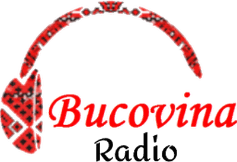 | Radio Bucovina | `radio-bucovina.png` | `https://www.radiobucovina.ro/wp-content/uploads/2021/05/cropped-cropped-RadioBucovina-1.png` (from `https://www.radiobucovina.ro/`) | Stream icy-name "Radio Bucovina Populara `www.RadioBucovina.ro`"; site header logo. |
| 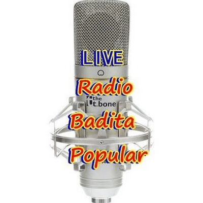 | Radio Bădiță Popular | `radio-badita-popular.png` | [proxy.zeno.fm/content/stations/agxzfnplbm8tc3RhdHNyMgsSCkF1dGhDbGllbnQYgICwsdObgggMCxIOU3RhdGlvblByb2ZpbGUYgICw0eXy3wkMogEEemVubw/image/?u=1669101814000](https://proxy.zeno.fm/content/stations/agxzfnplbm8tc3RhdHNyMgsSCkF1dGhDbGllbnQYgICwsdObgggMCxIOU3RhdGlvblByb2ZpbGUYgICw0eXy3wkMogEEemVubw/image/?u=1669101814000) | The zeno mount uw5dk1mapy8uv sends titles starting with "RBP -"; the zeno.fm page "Radio Badita Popular - Petrece cat traiesti" contains this mount. Its station image is used. |
| 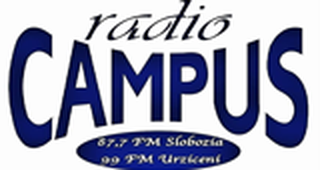 | Radio Campus | `radio-campus.png` | `https://cdn.onlineradiobox.com/img/l/3/64773.v8.png` (from `https://onlineradiobox.com/ro/campus/`) | Stream radio.campusbuzau.ro (icy-name "Radio CAMPUS Buzau"); onlineradiobox "Radio Campus" streams exactly that url, logo "radio CAMPUS" (Trust Campus network; the old url was Radio Campus Slobozia). The site only shows the Trust Campus group logo. Small source (160x85, upscaled 2x). |
| 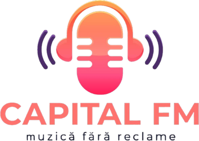 | Radio Capital FM Etno | `radio-capital-fm-etno.png` | [www.capitalfm.ro/wp-content/uploads/2025/03/Logo.png](https://www.capitalfm.ro/wp-content/uploads/2025/03/Logo.png) | icy-name "Capital FM Etno - `www.capitalfm.ro`"; og:image of capitalfm.ro (onlineradiobox uses the same logo for Radio Capital FM Romania Etno). |
|  | Radio Caprice Cool Jazz | `radio-caprice-cool-jazz.png` | [radcap.ru/graf2/radcaplogo.png](https://radcap.ru/graf2/radcaplogo.png) | radcap.ru/cooljazz.html plays port 9085 (Radio Caprice - Cool/West Coast Jazz). Radio Caprice brand logo (114x66 upscaled 2x); the channel pages only have artist photos. |
|  | Radio Caprice Dream Trance | `radio-caprice-dream-trance.png` | [radcap.ru/graf2/radcaplogo.png](https://radcap.ru/graf2/radcaplogo.png) | radio-browser lists 79.120.39.202:9029 as Radio Caprice - Dream Trance (radcap.ru/dreamtrance.html). Radio Caprice brand logo, upscaled 2x. |
|  | Radio Caprice Jazz Pop | `radio-caprice-jazz-pop.png` | [radcap.ru/graf2/radcaplogo.png](https://radcap.ru/graf2/radcaplogo.png) | radcap.ru/jazzpop.html plays port 9135 (Radio Caprice - Jazz Pop). Radio Caprice brand logo, upscaled 2x. |
| 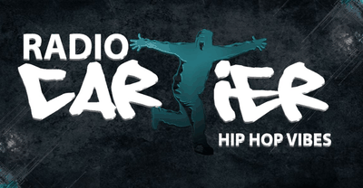 | Radio Cartier | `radio-cartier.png` | `https://radiocartier.eu/wp-content/uploads/2023/06/Imagine-WhatsApp-2023-06-17-la-13.47.1974.jpg` (cropped) | Port 8048 = live.radiocartier.eu:8048 (onlineradiobox Radio Cartier Romania, radiocartier.eu). The site logo is white on transparent, so the og:image banner (logo on a dark background) is used, cropped to the logo. |
| 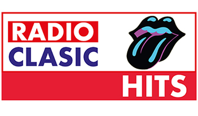 | Radio Clasic Hits | `radio-clasic-hits.png` | `https://www.clasicradio.ro/logo/hits.jpg` (from `https://www.clasicradio.ro/`) | Stream live.radioclasic.com/.../radio_clasic_hits, icy-name "Radio Clasic Hits"; the channel logo from clasicradio.ro (radio-browser uses it for this url). |
| 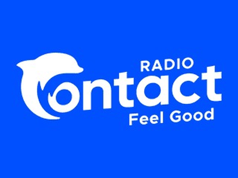 | Radio Contact | `radio-contact.png` | `https://www.radiocontact.be/app/uploads/2024/10/logoContact.jpeg` (from `https://www.radiocontact.be/`) | Belgian Radio Contact (old and new urls both on radiocontact.ice.infomaniak.ch; icy-url radiocontact.be, "Feel Good"); og:image logo. |
|  | Radio Crazy | `radio-crazy.png` | `https://crazyradio.ro/wp-content/uploads/2014/12/logo-3-1.png` (from `https://crazyradio.ro/`) | Stream icy-name "Radio Crazy Romania", icy-url crazyradio.ro; site logo. |
| 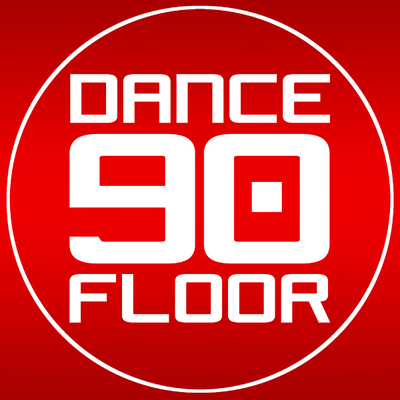 | Radio Dancefloor - 90s | `radio-dancefloor-90s.png` | [www.radiodancefloor.it/wp-content/uploads/2022/11/RDF_LOGO_2015_RED_600.png](https://www.radiodancefloor.it/wp-content/uploads/2022/11/RDF_LOGO_2015_RED_600.png) | Icy-Name "Radio Dancefloor 90s", icy-url radiodancefloor.it; site logo. |
| 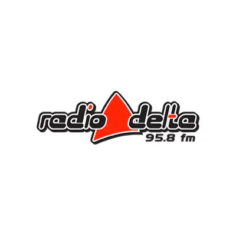 | Radio Delta | `radio-delta.png` | `https://radiodelta.ro/wp-content/uploads/2023/03/radio-delta.webp` (from `https://radiodelta.ro/`) | Stream icy-name "RADIO DELTA 95,8 FM", icy-url radiodelta.ro (Tulcea); og:image logo. |
| 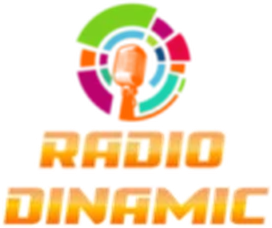 | Radio Dinamic | `radio-dinamic.png` | `https://radiodinamic.ro/wp-content/uploads/2026/logo/dinamicfm.webp` (from `https://www.radiodinamic.ro`) | Stream icy-name "Radio Dinamic - `www.RadioDinamic.Ro`"; site header logo (2026). |
| 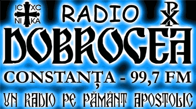 | Radio Dobrogea | `radio-dobrogea.png` | [cdn-radiotime-logos.tunein.com/s105356g.png](http://cdn-radiotime-logos.tunein.com/s105356g.png) | Stream stream.arhivaradiodobrogea.ro is listed by onlineradiobox/radio-browser as Radio Dobrogea (radiodobrogea.ro, 99.7 FM Constanta). The site only has a generic radio icon; TuneIn large logo used, cropped above the "www / live audio" footer lines. |
| 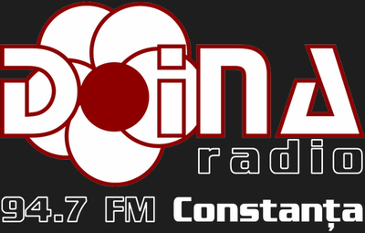 | Radio Doina FM | `radio-doina-fm.png` | `https://www.radiodoina.ro/wp-content/uploads/2025/11/doinafm-v4_logo.png` (from `https://www.radiodoina.ro/`) | Stream icy-name "Radio Doina", icy-url radiodoina.ro (94.7 FM Constanta); current site logo (2025, made for a dark background) placed on a dark background. |
|  | Radio Doxologia | `radio-doxologia.png` | `https://cdn.onlineradiobox.com/img/l/8/19308.v2.png` (from `https://onlineradiobox.com/ro/radiodoxologia/`) | Stream rlive.doxologia.ro, icy-name "Radio Doxologia - online"; onlineradiobox "Radio Doxologia" streams exactly that url. doxologia.ro only has the portal wordmark (white) and a tiny favicon. Small source (160x85, upscaled 2x). |
| 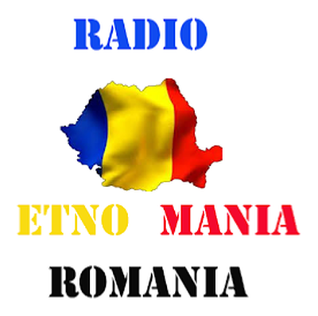 | Radio Etno Mania | `radio-etno-mania.png` | [radioetnomania.com/wp-content/uploads/2023/04/Radio-Etno-Mania.png](https://radioetnomania.com/wp-content/uploads/2023/04/Radio-Etno-Mania.png) | icy-name "Radio Etno Mania", icy-url radioetnomania.com; site logo. |
|  | Radio Etno Vest | `radio-etno-vest.png` | `https://play.google.com/store/apps/details?id=com.radioetnovest.timisoara` (app icon) | icy-name "Radio EtnoVest Timisoara"; radioetnovest.ro is down. Icon of the station's own Android app "Radio EtnoVest Timisoara". |
|  | Radio Expert | `radio-expert.png` | `https://radioexpertfm.ro/wp-content/uploads/2025/08/cropped-radio-expert-fm-648-doar-internet-romania-320-270x270.jpg` (from `https://radioexpertfm.ro/`) | Stream icy-name "Radio Expert Fm `www.RadioExpertFm.ro`"; site icon (round Radio Expert FM badge, 2025). |
|  | Radio Fx Net | `radio-fx-net.png` | `https://radiofxnet.ro/wp-content/uploads/2021/03/cropped-cropped-cropped-cropped-Radio_FX_Net_logo-1-1.png` (from `https://radiofxnet.ro/`) | Stream icy-name "Radio Fx Net Romania", icy-url radiofxnet.ro; site logo. |
| 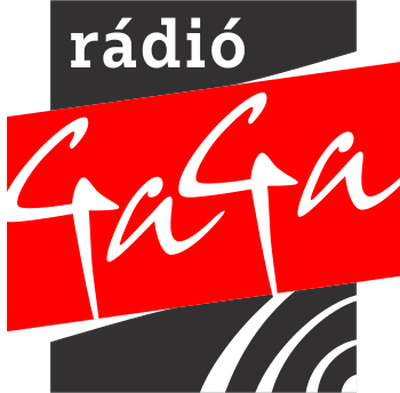 | Radio Gaga | `radio-gaga.png` | `https://cdn.radiogaga.ro/2022/04/GaGa_Logo_vilagos_hatterre.png` (from `https://www.radiogaga.ro/`) | Stream rc.radiogaga.ro (Radio GaGa, Hungarian-language, Transylvania; radio-browser homepage radiogaga.ro); site logo for light backgrounds. Note: the stream currently reports icy-name "End User Hold". |
|  | Radio Gansta | `radio-gansta.png` | `https://radiogangsta.ro/wp-content/uploads/2019/06/gangsta-radio.png` (from `https://radiogangsta.ro/`) | Stream icy-name "Radio Gangsta Manele Romania", icy-url radiogangsta.ro; header logo of the site (the favicon is only a red circle). |
| 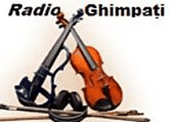 | Radio Ghimpați | `radio-ghimpati.png` | [ghimpatiradio.wordpress.com/wp-content/uploads/2018/12/cropped-Radio-2.jpg](https://ghimpatiradio.wordpress.com/wp-content/uploads/2018/12/cropped-Radio-2.jpg) | icy-name "Radio Ghimpati" (castradio.net port 8700); the station site radio-ghimpati.ucoz.es embeds the castradio.net p=8700 player. Logo from the station's own blog header (166x119, upscaled 2x). |
|  | Radio GoodLife | `radio-goodlife.png` | [radiogoodlife.com/wp-content/uploads/2020/03/Logo_G_Radio.png](https://radiogoodlife.com/wp-content/uploads/2020/03/Logo_G_Radio.png) | icy-name "GOODLIFE", icy-url radiogoodlife.com; generationdiscofunk.com redirects to radiogoodlife.com, so Generation Soul Disco Funk is now Radio GoodLife. Site logo. |
| 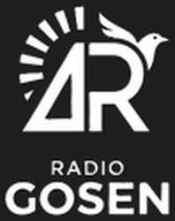 | Radio Gosen | `radio-gosen.png` | `https://www.radiogosen.com/uploads/7/4/0/5/7405817/editor/logo-transparent1.png` (from `https://www.radiogosen.com/`) | Stream icy-name "Radio Gosen Romania", icy-url radiogosen.com; the current site logo is white on transparent, so it is placed on a dark background to stay readable. |
| 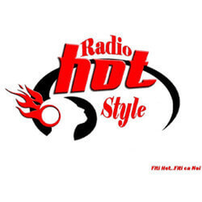 | Radio Hot Style | `radio-hot-style.png` | `https://www.radiohot.ro/wp-content/uploads/2022/04/RadioHot250.jpg` (from `https://www.radiohot.ro/`) | Stream icy-name "Radio Hot Style Romania `www.RadioHot.ro`"; og:image logo. |
| 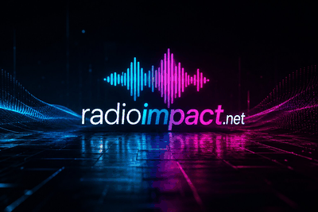 | Radio Impact | `radio-impact.png` | `https://radioimpact.net/images/radio-impact.jpg` (from `https://www.radioimpact.net`) | Stream icy-name "Radio IMPACT MaNeLe Romania \| `www.RadioImpact.net`"; the site og:image is its branded "radioimpact.net" wordmark on a dark background (the only logo it publishes; favicon is a generic icon, onlineradiobox entries are other streams). |
|  | Radio Iubire | `radio-iubire.png` | `https://radioiubire.ro/wp-content/uploads/2021/06/cropped-staf__sig-removebg-preview-270x270.png` (from `https://radioiubire.ro`) | Stream icy-name "Radio Iubire - `www.radioiubire.ro`"; site icon. |
| 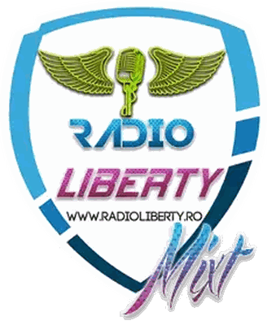 | Radio Liberty | `radio-liberty.png` | `https://www.radioliberty.ro/images/stations/1739903627.webp` (from `https://www.radioliberty.ro/listen/radio-liberty-mixt`) | Stream icy-name "Radio Liberty Mixt Romania"; radio-browser maps this exact url (sonicpanel.namehost.ro:1989) to Radio Liberty Mixt, whose channel logo on radioliberty.ro is used. |
|  | Radio Live 247 | `radio-live-247.png` | `https://radiolive247.ro/wp-content/uploads/2019/12/logo247-min.png` (from `https://radiolive247.ro`) | Stream icy-name "Radio Live247", icy-url radiolive247.ro; site logo. |
| 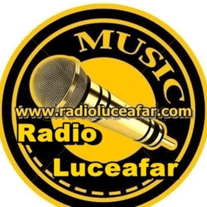 | Radio Luceafar | `radio-luceafar.png` | [cdn-profiles.tunein.com/s198774/images/logog.jpg](http://cdn-profiles.tunein.com/s198774/images/logog.jpg) | Stream live.radioluceafar.com; the TuneIn "Radio Luceafar" logo shows `www.radioluceafar.com.` radioluceafar.com itself returns 521. |
|  | Radio Manele FM | `radio-manele-fm.png` | `https://station-images-prod.radio-assets.com/300/fmradiomanele.png` (from `https://www.radio.net/s/fmradiomanele`) | Stream icy-name "Radio Manele Romania `wWw.FMRadioManele.Ro`"; fmradiomanele.ro is down (HTTP 523). radio.net logo reads "`www.FmRadioManele.Ro`" (onlineradiobox md/manele uses the same art). |
|  | Radio Nebunya | `radio-nebunya.png` | `https://radionebunya.ro/wp-content/uploads/2024/04/cropped-logo-radio.png` (from `https://radionebunya.ro`) | Stream icy-name "Radio NebunYa Manele `wWw.RaDioNeBunYa.Ro`"; og:image wordmark of the site (wide). |
| 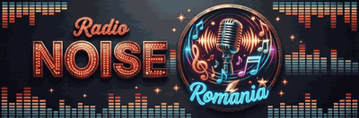 | Radio Noise | `radio-noise.png` | `https://www.radionoise.ro/wp-content/uploads/2026/07/Radio-Noise-Romania-MainLogo-544x.png` (from `https://www.radionoise.ro/`) | Stream icy-name "Radio Noise Romania", icy-url RadioNoise.ro; site main logo (2026). |
|  | Radio Orion 96,6 FM | `radio-orion-96-6-fm.png` | `https://orionfm.ro/ro` (inline SVG header logo, color #1f55ff from the site CSS) | icy-name "Orion FM - 96.6 MHz", icy-url orionfm.ro (Campulung Muscel). The site header logo is an inline SVG; rendered to PNG with headless Edge in the site's primary color. |
| 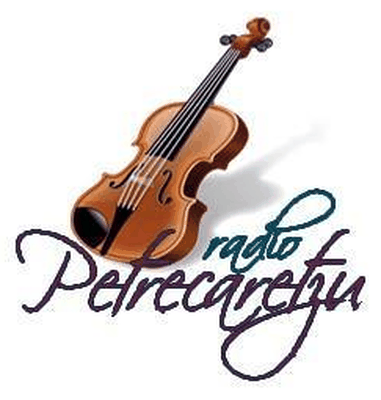 | Radio Petrecaretzu | `radio-petrecaretzu.png` | [www.radiopetrecaretzu.ro/wp-content/uploads/2020/06/pet.jpg](https://www.radiopetrecaretzu.ro/wp-content/uploads/2020/06/pet.jpg) | Stream radiopetrecaretzu.zapto.org:8383 = live.radiopetrecaretzu.ro:8383 (onlineradiobox Radio Petrecaretzu). Logo image from radiopetrecaretzu.ro. |
| 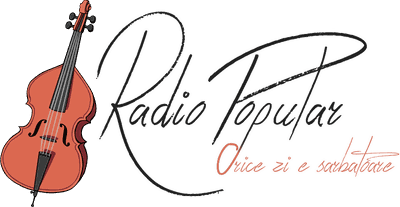 | Radio Popular | `radio-popular.png` | `https://www.radiopopular.ro/images/common/logo.png` (from `https://www.radiopopular.ro/`) | Stream colinde.radiopopular.ro, icy-name "Radio Popular Colinde Romania", icy-url radiopopular.ro; site logo. |
|  | Radio Popular Autentic | `radio-popular-autentic.png` | [www.radiopopular.ro/images/common/logo.png](https://www.radiopopular.ro/images/common/logo.png) | icy-name "Radio Popular Romania", icy-url radiopopular.ro; site header logo (same on TuneIn). |
| 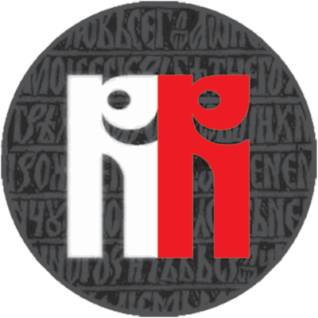 | Radio Renașterea | `radio-renasterea.png` | `https://radiorenasterea.ro/wp-content/uploads/2020/07/RR-rotund-Recovered-480x482.png` (from `https://radiorenasterea.ro/`) | Stream icy-name "Radio Renasterea", icy-url radiorenasterea.ro; site icon (round RR logo, radio-browser uses it for this url). |
|  | Radio Someș | `radio-somes.png` | [radiosomes.ro/logo.png](https://radiosomes.ro/logo.png) | icy-name "radio SOMES", icy-url radiosomes.ro. Site logo (100x100, upscaled 2x). |
| 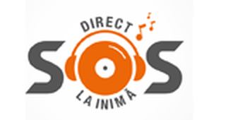 | Radio SOS | `radio-sos.png` | `https://cdn.onlineradiobox.com/img/l/2/20052.v4.png` (from `https://onlineradiobox.com/ro/radiosos/`) | Stream icy-name "Radio S.O.S. 101.7 FM Ploiesti"; onlineradiobox "Radio SOS" streams exactly 5.2.180.231:8000/stream. Small source (160x85, upscaled 2x). |
|  | Radio Stil | `radio-stil.png` | `https://radiostill.ro/wp-content/uploads/2023/09/still-300x120.png` (from `https://radiostill.ro`) | Stream icy-name "Radio Stil Romania - Manele", icy-url radiostill.ro; site header logo. |
|  | Radio Sud | `radio-sud.png` | `https://cdn.onlineradiobox.com/img/l/5/19085.v2.png` (from `https://onlineradiobox.com/ro/sud/`) | Stream media.gds.ro:8500/128.mp3 = Radio Sud Craiova 97.4 FM (radio-browser); onlineradiobox "Radio Sud" streams exactly that url and shows "RADIO SUD 97.4 FM". The site only has the emblem without the name. Small source (160x85, upscaled 2x). |
|  | Radio Sun Dance | `radio-sun-dance.png` | `https://radiosun.ro/wp-content/uploads/2021/12/radio-sun-dance-romania.jpg` (from `https://radiosun.ro/sun-dance-romania/`) | Stream live.radiosun.ro/sundance, icy-name "Radio Sun Dance Romania"; channel banner of radiosun.ro cropped to its logo part (sun + "Dance"). |
| 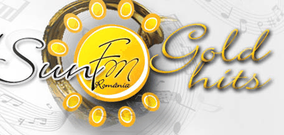 | Radio SunGold | `radio-sungold.png` | `https://radiosun.ro/wp-content/uploads/2021/12/radio-sun-gold-hits.jpg` (from `https://radiosun.ro/sun-gold-hits-romania/`) | Stream live.radiosun.ro/sungoldhits, icy-name "Radio Sun Gold Hits"; channel banner of radiosun.ro cropped to its logo part. |
|  | Radio SunLove | `radio-sunlove.png` | `https://radiosun.ro/wp-content/uploads/2021/12/radio-sun-love-romania.jpg` (from `https://radiosun.ro/sun-love-romania/`) | Stream live.radiosun.ro/sunlove, icy-name "Radio Sun Love Romania"; channel banner of radiosun.ro cropped to its logo part. |
|  | Radio Timișoara | `radio-timisoara.png` | [www.radiotimisoara.ro/wp-content/uploads/2024/01/logo-main-1280.png](https://www.radiotimisoara.ro/wp-content/uploads/2024/01/logo-main-1280.png) | Stream 89.238.227.6:8352 is listed on radio-browser as Radio Timisoara 630 AM (radiotimisoara.ro). og:image of the station site (Radio Romania Timisoara). |
|  | Radio UNO Digital | `radio-uno-digital.png` | [radiounodigital.com/envivo/assets/images/logo_radiouno.png](https://radiounodigital.com/envivo/assets/images/logo_radiouno.png) | icy-name "Radio UNO Digital", icy-url radiounodigital.com; og:image of the station site. |
|  | Radio Vestea Bună | `radio-vestea-buna.png` | `https://radiovesteabuna.ro/wp-content/uploads/2022/11/Logo-mic.jpg` (from `https://radiovesteabuna.ro/`) | Stream icy-name "Radio Vestea Buna", icy-url radiovesteabuna.ro ("Pentru fiecare copil"); site logo. |
|  | Radio Vip | `radio-vip.png` | `https://cdn.onlineradiobox.com/img/l/6/64476.v13.png` (from `https://onlineradiobox.com/ro/vipfm/`) | Stream icy-name "Radio VIP Manele - `wWw.RadioVip.ro`"; radiovip.ro is behind a bot check. onlineradiobox "Radio VIP FM" streams exactly live1.radiovip.ro:8969. Small source (160x85, upscaled 2x). |
|  | Radio Vocea Evangheliei | `radio-vocea-evangheliei.png` | `https://rvesibiu.ro/wp-content/uploads/elementor/thumbs/RVE-Sibiu-logo-rlcrj1dr7612yynmx2p38ecm0bqs3txbyso3y3xiie.png` (from `https://rvesibiu.ro`) | Stream stream.rvesibiu.ro, icy-name "RVE Sibiu"; site header logo. |
| 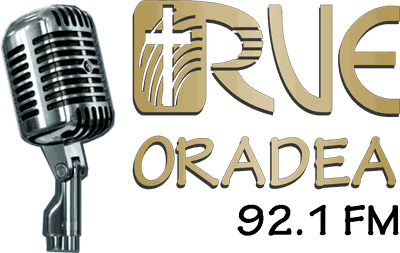 | Radio Vocea Evangheliei 92.1 FM | `radio-vocea-evangheliei-92-1-fm.png` | `https://rve-oradea.ro/wp-content/uploads/2025/06/Logo-RVE-Oradea.png` (from `https://rve-oradea.ro/`) | Stream icy-name "RVE Oradea", icy-url rve-oradea.ro (92.1 FM, matches the title); og:image logo. |
|  | Rete Due | `rete-due.png` | `https://station-images-prod.radio-assets.com/300/rsiretedue.png` (from `https://www.radio.net/s/rsiretedue`) | Stream stream.srg-ssr.ch/m/retedue (icy-name "RSI 2"), RSI Rete Due; radio.net logo (same as onlineradiobox, larger). |
| 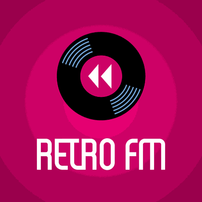 | Retro FM | `retro-fm.png` | `https://sky.ee/storage/radio-stations/2026/03/Station-Icon-1024x1024-1.png` (from `https://retrofm.sky.ee/`) | Stream stream.skymedia.ee/live/RETRO (Sky Media Estonia; old url retro.babahhcdn.com/RETRO); retrofm.ee og:image station icon. |
|  | RVE Suceava | `rve-suceava.png` | `https://apps.apple.com/us/app/radio-vocea-evangheliei/id6743744684` (artworkUrl512) | icy-name "RVE Suceava", icy-url rvesv.ro (Radio Vocea Evangheliei Suceava 94.2 FM). The site header logo is only 250x33, so the icon of the station's own app (linked from rvesv.ro) is used. |
|  | RVE Zalău | `rve-zalau.png` | `https://rve-zalau.ro/wp-content/uploads/2024/03/logo-rve.webp` (from `https://rve-zalau.ro`) | Radio Unison now broadcasts as RVE Zalau (icy-name "RVE Zalau", icy-url rve-zalau.ro); site logo. |
| 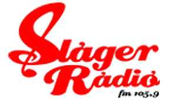 | Sláger Rádió | `slager-radio.png` | `https://cdn.onlineradiobox.com/img/l/6/20046.v6.png` (from `https://onlineradiobox.com/ro/slgerrdi/`) | Stream 89.37.193.61:8000/raspi did not answer during the check; onlineradiobox "Slager Radio" (fm 105.9, Sfantu Gheorghe) streams the same unusual mount 93.115.175.206:8000/raspi (same encoder on a changed IP), and the title matches. Small source (160x85, upscaled 2x). |
|  | Smooth Jazz NYC | `smooth-jazz-nyc.png` | [cdn.onlineradiobox.com/img/l/3/30373.png](https://cdn.onlineradiobox.com/img/l/3/30373.png) | icy-name "Smooth Jazz Mix NYC", icy-url smoothjazzmixnewyork.com (text-only site). onlineradiobox "Smooth Jazz MIX New York" logo, 160x85 upscaled 2x (low resolution but readable). |
|  | Smooth Jazz Tampa Bay | `smooth-jazz-tampa-bay.png` | [cdn-radiotime-logos.tunein.com/s274842g.png](http://cdn-radiotime-logos.tunein.com/s274842g.png) | icy-name "Smooth Jazz - Tampa Bay HD", icy-url smoothjazztampabay.co; the TuneIn "Smooth Jazz - Tampa Bay" logo shows `www.smoothjazztampabay.co.` |
|  | TranceBase.FM | `trancebase-fm.png` | [www.trancebase.fm/content/images/site/logo-trancebase.fm.png](https://www.trancebase.fm/content/images/site/logo-trancebase.fm.png) | listen.trancebase.fm = TranceBase.FM; site header logo (wide wordmark). |
| 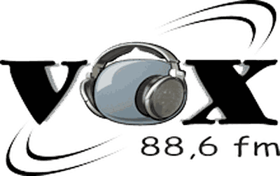 | Vox FM | `vox-fm.png` | `http://www.voxfm.ro/wp-content/themes/vox/dist/images/voxlogo.png` (from `http://www.voxfm.ro`) | Stream icy-name "VOXFM 88.6", icy-url voxfm.ro; site header logo. |
|  | Young Urban Lifestyles Radio | `young-urban-lifestyles-radio.png` | [yulradio.com/main/wp-content/uploads/2020/02/2020-YUL-Logo.jpg](https://yulradio.com/main/wp-content/uploads/2020/02/2020-YUL-Logo.jpg) | icy-name "Y.U.L. Radio - Young Urban Lifestyles Radio", icy-url yulradio.com; site logo (2020-YUL-Logo). |

## Still without a logo

| Station | Why |
| :--- | :--- |
| Cool Jazz 100 | icy-name "Cool Jazz 100", icy-url smoothsoul.net, which now redirects to 00jazz.com ("Jazz Infinity"/"Smooth Soul Radio"); no logo that can be tied to "Cool Jazz 100". |
| Dip Music | Stream icy-name "Radio Dip Music Romania - Manele", icy-url paul-ionescu.eu (domain no longer resolves). Not listed on onlineradiobox, radio-browser, radio.net or myTuner; no logo source found. |
| Hot 107.1 FM | 192.99.34.205:8607 does not answer (no headers, no Shoutcast status pages) and is not on radio-browser by url; the station cannot be identified, so no logo. |
| Radio Amma | Stream icy-name "Radio Amma manele" but icy-url radioelegant.com (dead); onlineradiobox lists this exact stream (ssl.omegahost.ro:8024 = 54.39.28.158:8024, same song) as "Radio Elegant" with an "Elegant Radio" logo (`https://cdn.onlineradiobox.com/img/l/9/158319.v1.png`). The station name and the only logo disagree, so no file; the caller may use that logo if it accepts Amma = Elegant. |
| Radio Funky | Stream icy-name "Radio FUNKY Manele Romania - `wWw.RadioFunky.Ro`". The site has no logo image (header is an icon font plus text); the onlineradiobox "Funky Radio" is a different station (Triton stream). No logo found. |
| Radio Sound for you | Stream icy-name "Radio_SoundFourYou" (Sound Four You, Craiova). The only logo found (onlineradiobox 160x85, also the radio-browser favicon) is blurred and unreadable; no website (xat.com room). |
| Radio Tradiţional Popular | populara.radiotraditional.ro:7600 did not answer. radiotraditional.ro has no logo image; the only brand image found is a 160x85 onlineradiobox logo of the sister channel "Radio Traditional - Oldies" - too small and not this channel. |
| Smooth Jazz Oasis | icy-name "Smooth Jazz Oasis"; smoothjazzoasis.com frames a Wix site with only a stock photo; no logo found in the directories. |

## Worth knowing

- The stations that now broadcast under another name were renamed in ventura8/RoRadioResources#4 (`docs/releases/2026-09-29-renames.md`); their logos here are the ones of what plays now (ALT FM Arad, DHR FM, MFM Dance, RVE Zalău, RVE Suceava, goFM, 1.FM Euro 80's, Radio GoodLife, Jazz & Chill). Radio x net, a copy of Radio Manele FM, was removed there, so it has no logo here.
- Nine logos come from 160x85 directory images scaled up twice (Radio 1, Radio VIP, Dream FM, Radio Campus, Radio Doxologia, Radio SOS, Radio Sud, Smooth Jazz NYC, Sláger Rádió): readable, not sharp. A sharper file can replace any of them under the same name.
- White-on-transparent logos (Radio Gosen, Radio Aquila, Radio Doina FM, Marosvásárhelyi Rádió) sit on a dark square so that they read on the light theme too.
