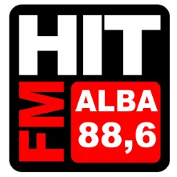
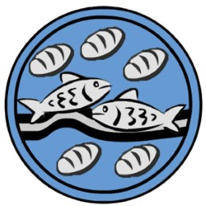
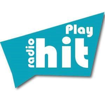
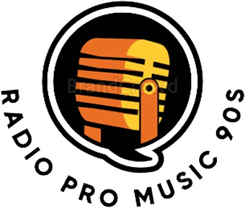
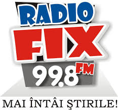
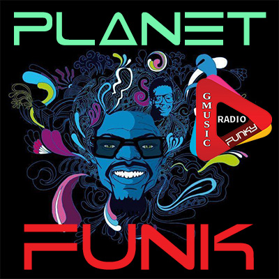
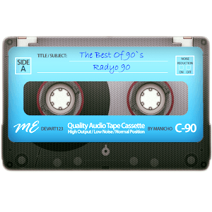

# Station revival, 2026-09-29

Pull request [ventura8/RoRadioResources#2](https://github.com/ventura8/RoRadioResources/pull/2). Every RoRadio app downloads the station list from [GitHub Pages](https://ventura8.github.io/RoRadioResources/RadioStationsData.json), so these changes reach listeners when this is merged, without an app update.

## Summary

| What | Count |
| :--- | ---: |
| Stations before | 284 |
| Stations after | 230 |
| Streams that play again (new url) | 74 |
| Stations removed: no longer broadcast (owner's decision) | 47 |
| Stations removed: the same programme as a listed station | 3 |
| Stations removed: the same title as another station | 4 |
| Streams that play now (probe of 230 stations) | 221 |
| Logos in `RadioLogos/` | 116 |
| Logos replaced (same file name) | 6 |

## Streams that play again

Each new url was probed `alive` (audio bytes, not a web page) and tied to the station by more than its name: the stream's `icy-name`, the broadcaster's own player, a frequency, a town or a logo. "Renamed" means the same station, frequency or stream now carries another name; the title is unchanged.

| Logo | Station | Old url | New url | Found on | How it was identified |
| :---: | :--- | :--- | :--- | :--- | :--- |
| - | 181 FM | `http://208.84.155.85:8048/` | `https://listen.181fm.com/181-lite90s_128k.mp3` | [www.181.fm](https://www.181.fm/) | Catalogue description 'Lite 90s'; official 181.FM Lite 90's channel (icy-name '181.FM Lite 90s', icy-url 181.fm); also in radio-browser as '181.FM - Lite 90's'. |
| - | 1Mix Radio | `http://94.23.209.225:8062/` | `http://fr1.1mix.co.uk:8060/320` | [www.1mix.co.uk/trance/listenxh.m3u](http://www.1mix.co.uk/trance/listenxh.m3u) | Official 1Mix Radio Trance 320k playlist (listenxh.m3u lists fr1/fr2 :8060/320); icy-name '1Mix Radio'. No https endpoint answers. Mirror `http://fr2.1mix.co.uk:8060/320` also alive. |
| - | 80s 90s (renamed) | `http://185.33.21.112:11267/` | `https://strm112.1.fm/80s_90s_mobile_mp3` | [www.1.fm/station/80s_90s](https://www.1.fm/station/80s_90s) | Old host 185.33.21.112 is 1.FM's server (radio-browser lists 1.FM mounts on it). The same 1.FM '80s_90s' channel now broadcasts as '1.FM Euro 80's' (icy-name); radio-browser: '1.FM - All Euro 80's Radio' on this mount. |
|  | Dance Effect Radio | `http://asculta.danceeffect.ro:3333/` | `https://asculta.danceeffect.ro:9443/;` | [www.danceeffect.ro](https://www.danceeffect.ro/) | Stream embedded on the station's own site (same host asculta.danceeffect.ro, new https port 9443). |
| - | Dip Music | `http://163.172.7.220:8021/` | `http://164.132.169.60:8021/;` | [yp.shoutcast.com/sbin/tunein-station.pls?id=100325577](http://yp.shoutcast.com/sbin/tunein-station.pls?id=100325577) | Shoutcast directory entry 'Radio Dip Music Romania - Manele' (genre Manele) now on 164.132.169.60:8021 - same port 8021 as the old url. Status page: 'Stream Title: Radio Dip Music Romania - Manele', playing current manele. SHOUTcast 1.9.8 'ICY 200 OK' server: the updated probe now reports it alive. No https on that port. Found by: Shoutcast directory (round 1 had it but the old probe rejected ICY). |
| - | Dream FM | `http://dreamfm.dtech.ro:9220/` | `http://dreamfm.dtech.ro:9220/dreamfm` | [onlineradiobox.com/ro/dream](https://onlineradiobox.com/ro/dream/) | Dream FM Onesti 92.2 on its own server; the old url lacked the /dreamfm mount. https on the same port does not answer. Also in radio-browser (Dream FM -Onesti 92,2 FM). |
|  | EnergyFM | `http://89.39.189.59:9300/;stream.nsv` | `https://fra-pioneer01.dedicateware.com:2930/stream` | [radioenergyfm.com/deep](https://radioenergyfm.com/deep/) | energyfm.ro now redirects to radioenergyfm.com (RADIO ENERGY, channels Classic / Deep House / Trance). Catalogue category House + energy-fm-house.png -> the 'DEEP HOUSE ENERGY (radioenergyFM.com)' channel, whose page player uses this server (port 2930). |
| - | Funstudio DanceRadio | `http://37.58.63.90/` | `https://a6.asurahosting.com/listen/funstudio/radio.mp3` | [funstudio.de](https://funstudio.de/) | icy-name 'Funstudio Danceradio', icy-url funstudio.de; radio-browser lists this url for Funstudio Danceradio. |
| - | Generation Soul Disco Funk | `http://91.121.104.123:8000/` | `https://gestream.fr/g-radio-hd.mp3` | [www.generationdiscofunk.com](https://www.generationdiscofunk.com/) | HD stream linked on the station's own site (SD alt: `https://gestream.fr/g-radio-sd.aac`). |
|  | Hit FM Alba | `http://s3.myradiostream.com/4404/listen.mp3` | `https://radio.sonicpanel.ro:8082/stream` | [hitfm.ro](https://hitfm.ro/) | hitfm.ro player config: streamAlba = `https://radio.sonicpanel.ro:8082/stream.` |
| - | jamz | `http://185.33.21.112:11282/` | `https://strm112.1.fm/jamz_mobile_mp3` | [www.1.fm/station/jamz](https://www.1.fm/station/jamz) | Old host 185.33.21.112 is 1.FM's server; the 1.FM 'jamz' channel (hip hop/rnb) is on this mount (radio-browser '1.FM - Jamz Radio'). Current icy-name reads '1.FM Top Rap'. |
|  | Micul Samaritean FM | `http://162.251.160.26/stream` | `https://online.miculsamaritean.com:8000/radio.mp3` | [www.miculsamaritean.com](https://www.miculsamaritean.com/) | Player stream on the station's own site (the same page still references the old iCastCenter server 162.251.160.26, which is dead). |
| - | Muntenia FM | `http://munteniafm.servemp3.com:8000/` | `https://ssl.radios.show/8012/stream` | [mfmdance.ro](https://mfmdance.ro/) | Station site title 'MFM DANCE - Muntenia FM (105,7 FM, Pitesti)'; it links `http://munteniafm.servemp3.com:8012/listen.pls` (same host as the old url) and this https stream. Brand now shown as MFM Dance. |
| - | Play Radio 90's - removed later as a duplicate | `http://live.playradio.org:9000/;` | `http://live.playradio.org:9090/90HD` | [live.playradio.org:9090/status-json.xsl](http://live.playradio.org:9090/status-json.xsl) | Play Radio's own Icecast (live.playradio.org) now serves the 90's channel as mount /90HD (192k AAC, 'Play 90''s [Broadband HD]'). WARNING: the catalogue already has the same channel as 'Play 90''s' (GUID 4f803f97-7c4d-4505-a376-6190e77ecb24, `https://live.playradio.org:8443/90HD`); this is the http/9090 mirror, so the url passes the no-containment rule, but the owner may prefer to drop this duplicate station instead. |
|  | Play Radio Hit (renamed) | `http://str2b.openstream.co/1419` | `https://playradiohit-adradio.radioca.st/stream` | [radiopromusic.ro](https://radiopromusic.ro) | openstream.co now 308-redirects to https that fails the TLS handshake. Play Radio Hit continues as 'Radio Pro Music' (radiopromusic.ro, whose meta keywords are 'play radio hit, playradiohit'); its Shoutcast host playradiohit-adradio.radioca.st answers icy-name 'Radio Pro Music', icy-url radiopromusic.ro, 128k MP3. |
|  | Play Radio Hit 90s (renamed) | `http://str2b.openstream.co/1421` | `https://playradiohit90-adradio.radioca.st/stream` | [adradio.ro/sites/default/files/fisiere_pls/playradiohit.pls](https://adradio.ro/sites/default/files/fisiere_pls/playradiohit.pls) | The AdRadio playlist titled 'Play Radio Hit 90s' points to stream.adradio.ro/8414, which redirects to playradiohit90-adradio.radioca.st; that stream now answers as 'Radio Pro Music 90s' (icy-url radiopromusic.ro, 128k MP3). The direct radioca.st url skips AdRadio's ad-insertion redirect. |
| - | Plusz FM | `http://hosting2.42netmedia.com:8961/stream` | `https://stream2.radiotransilvania.ro/Nagyvarad` | [pluszfm.ro](https://pluszfm.ro/) | Plusz FM, the Hungarian-language station in Oradea (Nagyvárad) on 89.6 FM. Its official site streams from stream2.radiotransilvania.ro/Nagyvarad (192k). There is also a Marghita relay at /Margitta. |
| - | Radio Amma | `http://93.115.37.60:7002/` | `http://54.39.28.158:8024/stream` | [yp.shoutcast.com/sbin/tunein-station.pls?id=99627489](http://yp.shoutcast.com/sbin/tunein-station.pls?id=99627489) | Shoutcast directory search 'Amma' -> 'Radio Amma manele' (id 99627489) on 54.39.28.158:8024/stream (HostClean.ro manele hosting, Shoutcast 2.6.1). icy-name 'Radio Amma manele', genre Manele, playing 2026 manele; matches the catalogue's manele station (old hosts radioammamanele.ro / radio-amma.no-ip.biz). https on the port answers but the certificate does not verify (IP), so http is proposed. Found by: Shoutcast directory search API (directory.shoutcast.com/Search/UpdateSearch). |
|  | Radio AS | `http://radioas.suceava.rdsnet.ro:8000/sample128` | `http://86.123.70.144:8000/sample128` | [live.radioas.ro](http://live.radioas.ro/) | Radio AS Suceava. The official live page live.radioas.ro plays `http://86.123.70.144:8000/sample128` (icy-name RadioAS), the same mount path on a new IP. ORB lists the same url. No https variant exists. |
| - | Radio Atentat | `http://149.202.158.82:7777/stream` | `https://ssl.omegahost.ro/8066/stream` | [atentat.ro](http://atentat.ro/) | The official site atentat.ro links `https://ssl.omegahost.ro/8066/stream` (icy-name 'Radio A-tentat'). The same port 8066 is also at sonicpanel.hostclean.ro:8066 (listed by ORB and atentat.ro/asculta.m3u). |
| - | Radio B Zone | `http://5.39.71.159:8000/stream` | `https://bzone.radioca.st/stream` | [www.b-zone.ro](https://www.b-zone.ro/) | B-Zone.ro community radio. b-zone.ro links orion.shoutca.st:8980, and the https alias bzone.radioca.st/stream serves the same stream (icy-name 'SC B-ZONE.RO SRL (RO37160256) Stream'). liveonlineradio also lists bzone.radioca.st. |
|  | Radio Best FM | `http://193.238.57.106:2000/` | `https://play.discomix.ro/8006/stream` | [bestfm.ro](https://bestfm.ro/) | Radio Best FM from Prahova (Ploiești, Câmpina, Sinaia); the old IP geolocates to Ploiești. bestfm.ro lists the 320 kbps stream as `https://play.discomix.ro/8006/stream` (Shoutcast serverurl bestfm.ro). /8006/discomix128 and /8006/discomix64 are lower-bitrate alternatives. |
| - | Radio Bădiță Popular | `http://89.39.189.29:8000/;` | `https://stream.zeno.fm/uw5dk1mapy8uv` | [zeno.fm/radio/radio-badita-popular-petrece-cat-traiesti-1srb](https://zeno.fm/radio/radio-badita-popular-petrece-cat-traiesti-1srb/) | Folk and party station from Alexandria, run by Badita Dan, with the motto 'Petrece cat traiesti'. The old Shoutcast server is dead. The station's Zeno page streams stream.zeno.fm/uw5dk1mapy8uv, which answers with icy-name 'Radio Badita Popular - Petrece cat traiesti'. |
|  | Radio Băilesti | `http://86.123.234.0/bailestifm` | `https://asculta.radiobailesti.ro/bailestifm` | [onlineradiobox.com/ro/bailestioltenia](https://onlineradiobox.com/ro/bailestioltenia/) | Radio Băilești Oltenia. It streams from the same /bailestifm mount on the station's own host (icy-name 'Radio Bailesti Oltenia', AAC+). The official /live page links stream.radiobailesti.ro/bailestifm, but that currently redirects to the homepage. |
| - | Radio Campus | `http://82.208.130.74:7000/` | `https://radio.campusbuzau.ro:8443/CAMPUS.mp3` | [www.campusbuzau.ro](https://www.campusbuzau.ro/) | Radio Campus is the Romanian FM network in Buzău (98.0), Slobozia (87.7) and Urziceni (99). campusbuzau.ro's radio-campus.m3u points to this url (icy-name 'Radio CAMPUS Buzau'), and ORB 'Radio Campus' and radio.garden use it too. The old UPC-hosted url cannot be tied to a specific studio. The Slobozia/Urziceni feed is at `https://free.rcast.net/72294` if that is the intended one. |
| - | Radio Clasic Hits | `http://www.clasicradio.ro:7000/` | `https://live.radioclasic.com/listen/radio_clasic_hits/live.mp3` | [www.clasicradio.ro](https://www.clasicradio.ro/) | Clasic Radio moved all its channels to AzuraCast at live.radioclasic.com (192k MP3); the icy-name is 'Radio Clasic Hits'. |
|  | Radio Clasic Kids | `http://www.clasicradio.ro:7600/;` | `https://live.radioclasic.com/listen/radio_clasic_kids/live.mp3` | [www.clasicradio.ro](https://www.clasicradio.ro/) | This is the Kids channel on the same AzuraCast server (icy-name 'Radio Clasic Kids'). |
|  | Radio Clasic Popular | `http://37.251.146.169:7700/;stream.mp3` | `https://live.radioclasic.com/listen/radio_clasic_popular/live.mp3` | [www.clasicradio.ro](https://www.clasicradio.ro/) | This is the Popular channel on the same AzuraCast server (icy-name 'Radio Clasic Popular'). |
| - | Radio CNM (renamed) | `http://asculta.radiocnm.ro:8002/live` | `https://altfm.faur.cc/alt_fm_256` | [www.radiocnm.ro](https://www.radiocnm.ro/) | Radio CNM, the Christian station in Arad (1602 AM), is now 'Radio ALT FM Arad'. radiocnm.ro serves the AltFm site (Radio ALT FM Arad, Str. Sinaia 17), and its live players (fm.altfm.ro and am.altfm.ro) play altfm.faur.cc/alt_fm_128. The Icecast server also has 256k and 64k mounts; 256k AAC was chosen. The old server now reports 'Radio 3 Sixteens'. |
| - | Radio Contact | `http://radio-contact.ice.infomaniak.ch/radio-contact-high.aac` | `https://radiocontact.ice.infomaniak.ch/radiocontact-mp3-192.mp3` | [www.radiocontact.be](https://www.radiocontact.be/) | Belgian Radio Contact on the same Infomaniak host. The mount was renamed from radio-contact/radio-contact-high.aac to radiocontact/radiocontact-mp3-192.mp3; radio-browser lists it with homepage radiocontact.be. The AAC mounts return 404. |
| - | Radio Delta | `http://94.24.49.42:9998/` | `https://mars.streamerr.co/8152/stream` | [radio.garden/api/ara/content/channel/uO78dDN8](https://radio.garden/api/ara/content/channel/uO78dDN8) | Radio Delta Tulcea, 95.8 FM (radiodelta.ro). radio.garden (website radiodelta.ro) and ORB both play this stream, whose icy-name is 'RADIO DELTA 95,8 FM' (AAC+). |
| - | Radio Dinamic | `http://asculta.radiodinamic.com:9000/;` | `https://asculta.radiodinamic.ro:8030/stream` | [www.radiodinamic.ro](https://www.radiodinamic.ro/) | This is the manele station, which moved from radiodinamic.com to radiodinamic.ro. Its site player uses `https://asculta.radiodinamic.ro:8030/stream` (icy-name 'Radio Dinamic - Radio Manele - `www.RadioDinamic.Ro`'). |
| - | Radio Etno Mania | `http://live.radioetnomania.net:9300/` | `https://live.radioetnomania.com:9300/stream` | [radioetnomania.com](https://radioetnomania.com/) | The domain changed from .net to .com with the same port 9300. The site's SonicPanel player (live.radioetnomania.com/cp/widgets/player/single/?p=9300) plays this stream (icy-name 'Radio Etno Mania'), and radio-browser lists it. |
|  | Radio Fix | `http://86.122.4.136:8000/;` | `http://89.137.76.149:8000/stream` | [onlineradiobox.com/ro/radiofix](https://onlineradiobox.com/ro/radiofix/) | Radio Fix Botoșani, 99.8 FM (radiofix.ro; the old IP is also in Botoșani). ORB and radio-browser list 89.137.76.149:8000, whose icy-name is 'Radio Fix'. No https variant exists. |
|  | Radio Gaia | `http://sc-radiogaia.1.fm:10036/` | `https://strm112.1.fm/radiogaia_128` | [www.1.fm/station/radiogaia](https://www.1.fm/station/radiogaia) | This is 1.FM's Radio Gaia channel. 1.FM retired its sc-*.1.fm Shoutcast hosts; the current stream is strm112.1.fm/radiogaia_128 (icy-name '1.FM Gaia'), per radio-browser (homepage 1.fm/station/radiogaia). |
| - | Radio Ghimpați | `http://173.212.224.141:8800/stream` | `http://185.216.214.92:8700/;` | [radio-ghimpati.ucoz.es](http://radio-ghimpati.ucoz.es/) | The station's own site embeds `http://castradio.net:8700/`; (SonicPanel port 8700, icy-name 'Radio Ghimpati'). The hostname castradio.net is blocked by this machine's DNS resolver (192.168.1.1 answers 0.0.0.0; Cloudflare DNS gives 185.216.214.92), so the probe here can only reach it by IP. The hostname form `https://castradio.net/8700/stream` also plays (checked with curl --resolve) and is better for other users. Pick the IP form only if the owner's network keeps blocking castradio.net. |
|  | Radio GMusic Planet Funk | `https://play.wrhradios.com:7017/stream?icy=http` | `https://play.webradio-hosting.com:8036/stream` | [onlineradiobox.com/ro/gmusicplanetfunk](https://onlineradiobox.com/ro/gmusicplanetfunk/) | icy-name 'Radio GMusic - Planet Funk', icy-url radiogmusic.com, 320 kbps. The same webradio-hosting.com provider hosts the other GMusic stations in the catalogue. |
|  | Radio GMusic Relax Garden | `https://play.wrhradios.com:7000/stream?icy=http` | `https://play.webradio-hosting.com:8002/stream` | [onlineradiobox.com/ro/gmusicrelaxgarden](https://onlineradiobox.com/ro/gmusicrelaxgarden/) | icy-name 'Relax Garden by radioGmusic.com'. radio-browser also lists it as 'Radio GMusic Relax' with this URL. |
| - | Radio Gosen | `http://ascultaradiogosen.no-ip.org:8125/` | `https://sp.totalstreaming.net/8125/stream` | [www.radiogosen.com](https://www.radiogosen.com/) | The official site links sp.totalstreaming.net port 8125, the same port as the old URL. Radio Gosen Romania, Sângeorz-Băi (radio-browser, onlineradiobox /ro/gosen/). |
| - | Radio Hit Romania (renamed) | `http://live.radio-hit.ro:8888/` | `https://live.dancemusic.ro/listen/dance/radio.mp3` | [www.radio-hit.ro](http://www.radio-hit.ro/) | radio-hit.ro now redirects to dhrfm.ro. The station's own host live.radio-hit.ro:8500 (onlineradiobox /ro/hitromania/ 'Radio Hit Romania') now broadcasts icy-name 'DHR FM (Deep House Radio) - Romania'. The same program runs on the operator's AzuraCast as the 'dance' mount chosen here, in https. Alternative, also probed alive: `http://live.radio-hit.ro:8500/`;. DHR FM is not in the catalogue yet. Consider retitling the entry to 'DHR FM'. |
| - | Radio Impact | `http://89.39.189.159:8000/;stream.mp3` | `https://asculta.radioimpact.net:8108/stream` | [radioimpact.net](https://radioimpact.net/) | Radio Impact România (Bucharest, online since 1998). Its main stream is 'Radio IMPACT MaNeLe Romania' (manele.pls). The old server was a Bucharest IP (Astimp). Medium identity confidence: another 'Radio Impact' exists at igjtv.ro (Târgu Jiu), but its Icecast at 82.79.222.229:8000 and the onlineradiobox stream 75.119.131.202:8006 are both dead. Sister streams on radioimpact.net: :8132 Dance and :8134 Petrecere. |
| - | Radio indiGo (renamed) | `https://live.gofm.ro:2000/stream/goFM.ro/stream.mp3?ver=882022` | `https://live.gofm.ro:2020/stream/gofmro` | [play.gofm.ro](https://play.gofm.ro/) | The old URL was already the goFM.ro mount. onlineradiobox /ro/indigo/ 'IndiGO' (gofm.ro, 'Best music station for house') points at it too. The GoFM web player (play.gofm.ro bundle) now uses live.gofm.ro:2020/stream/gofmro, icy-name 'goFM.ro'. No 'indigo' mount exists any more (502). Consider retitling to 'GoFM'. Do not confuse it with the separate catalogue entry 'Indigo FM' (82.78.176.198). |
| - | Radio Liberty | `http://5.196.53.110:1989/stream` | `https://sonicpanel.namehost.ro:1989/stream` | [www.radioliberty.ro/listen/radio-liberty-mixt](https://www.radioliberty.ro/listen/radio-liberty-mixt) | Radio Liberty Romania (Bucharest). This is the flagship mixed stream 'Radio Liberty Mixt Romania - Radio Manele - Radio Dance', on the same port 1989 as before. Not used by the catalogue's 'Radio Liberty popular' (populara.radioliberty.ro). |
| - | Radio Live 247 | `http://asculta-server19.radiolive247.ro:9000/` | `https://online.radiolive247.ro:9010/radio.aac` | [live.radiolive247.ro](https://live.radiolive247.ro/) | The official player page uses this URL. The same station (icy-name 'Radio LIVE 247 Romania - Bucuresti') is also at `https://stream19.expo-media.eu:9000/radio.mp3` (128k MP3, probed alive) and `https://stream19.expo-media.eu/radio/9000/aac64` (onlineradiobox). |
| - | Radio Orion 96,6 FM | `http://orionfm.go.ro:8008/live.mp3` | `https://cast.orionfm.ro/listen/orion/public.mp3` | [orionfm.ro](https://orionfm.ro/) | Orion FM 96.6 MHz, Câmpulung Muscel. icy-name 'Orion FM - 96.6 MHz', icy-url orionfm.ro, 256 kbps. radio-browser lists it with the same URL. |
|  | radio PRO diaspora | `http://62.75.162.168:8000/;` | `https://radio.prodiaspora.com/listen/prodiaspora/radio.mp3` | [prodiaspora.com/wp](https://prodiaspora.com/wp/) | Radio ProDiaspora ('un radio de VIS', Nuremberg/Zirndorf). The official site links `https://radio.prodiaspora.com/live`, which 302-redirects to this URL (icy-name 'ProDiaspora - radio online'). A mirror also plays: `https://online.asculta.eu/listen/prodiaspora/radio.mp3.` |
|  | Radio Romanian Hip Hop | `https://asculta.radioromanian.net/8400/stream` | `https://asculta.radioromanian.net/hiphop` | [onlineradiobox.com/ro/romanianhiphop](https://onlineradiobox.com/ro/romanianhiphop/) | The same host changed from a port path to a named mount. icy-name 'Radio Romanian Hip-Hop', icy-url radioromanian.ro (Găești). 64k AAC+. |
| - | Radio RVE | `http://94.75.227.133:7280/` | `https://stream.rvesv.ro/rvesv.mp3` | [radiovoceaevangheliei.ro/reteaua-rve](https://radiovoceaevangheliei.ro/reteaua-rve/) | Identity resolved: the Wayback Machine has the old server's SHOUTcast status page (`web.archive.org/web/20180709143419/http://94.75.227.133:7280/index.html?sid=1`) and it reads 'Stream Name: RVE Suceava - 94.2 FM - `www.rvesv.ro`'. So this entry is RVE Suceava 94.2 FM. Its current stream `https://stream.rvesv.ro/rvesv.mp3` answers icy-name 'RVE Suceava', icy-url `www.rvesv.ro`, 128k (listed on the RVE network page). Low-bitrate mirror: `https://s9.yesstreaming.net:7014/stream` (48k, same icy-name, TuneIn s339201). No other catalogue entry uses either url (the other RVE entries are Oradea, Sibiu and Zalau). |
| - | Radio Sound for you | `http://radio-soundfouryou.radi0.im:8000/` | `https://ssl.asculta.live/8222/stream` | [onlineradiobox.com/ro/soundfouryou](https://onlineradiobox.com/ro/soundfouryou/) | icy-name 'Radio_SoundFourYou' (Craiova, per radio-browser 'Sound Four You -Craiova'). onlineradiobox uses `https://ssl.asculta.live:8222/`;, which is the same stream. |
| - | Radio Stil | `http://176.31.60.21:8888/stream` | `https://mp3.radiostill.ro/8888/stream` | [radiostill.ro](https://radiostill.ro/) | Radio Stil Romania (radiostill.ro). This is its main stream, same port 8888, icy-name 'Radio Stil Romania - Manele'. The official site links exactly this URL. Sister streams: dance.radiostill.ro/8166 and popular.radiostill.ro/8176. Not the same station as the catalogue's 'Stil FM'. |
|  | Radio Stil Mix Dance | `http://stream.zeno.fm/886ym329mbruv` | `https://stream.zeno.fm/fc2tinsbwjftv` | [zeno.fm/radio/radio-stil-mix-dance-107-9-mhz-fm](https://zeno.fm/radio/radio-stil-mix-dance-107-9-mhz-fm/) | Radio Stil Mix Dance 107.9, Galați. Its own Zeno page now carries mount fc2tinsbwjftv, and onlineradiobox /ro/stilmixmanele/ ('RADIO STIL MIX DANCE 107.9 MHz FM') uses the same mount. Zeno sometimes answers 401 when the source is briefly off: it returned 401 once, then was alive on 2 probes. |
| - | Radio SunGold | `http://live.radiosun.ro/sungold` | `https://live.radiosun.ro/sungoldhits` | [radiosun.ro/sun-gold-hits-romania](https://radiosun.ro/sun-gold-hits-romania/) | The same Radio Sun channel with its mount renamed to 'Sun Gold Hits' (onlineradiobox /ro/sungoldhits/). AAC+. Not contained in any other Radio Sun URL in the catalogue. |
| - | Radio Transilvania Aleșd - removed later as a duplicate | `http://92.61.114.191:9720//;stream.nsv&type=mp3` | `http://stream2.radiotransilvania.ro:8000/Oradea` | [radiotransilvania.ro/localitatea/9/alesd](https://radiotransilvania.ro/localitatea/9/alesd) | The official Aleșd (95.8 FM) page plays the Oradea stream, and the Icecast server has no Aleșd mount. radio-browser 'Transilvania -statia Aleșd 95.8 FM' uses the same URL. The old URL is the one duplicate that RadioRepoTest pins (shared with 'Radio Transilvania Oradea'), so coordinate with whoever revives Oradea. Either give both the same new URL and update the pinned string in RadioRepoTest.RadioRepoDuplicateUrlTest, or use the equivalent distinct URL `http://stream2.radiotransilvania.ro:8000/Oradea` for Aleșd (also probed alive; icecast listenurl). With distinct URLs the test's expected duplicate count of 1 must become 0. |
|  | Radio Transilvania Baia Mare | `http://stream-rt.davacloud.ro:8000/BaiaMare.mp3` | `https://stream2.radiotransilvania.ro/BaiaMare` | [stream2.radiotransilvania.ro/status-json.xsl](https://stream2.radiotransilvania.ro/status-json.xsl) | Radio Transilvania moved its Icecast from stream-rt.davacloud.ro to stream2.radiotransilvania.ro; mount BaiaMare ("RT BaiaMare HTTPS", 128 kbps). |
|  | Radio Transilvania Bistrița | `http://stream-rt.davacloud.ro:8000/Bistrita.mp3` | `https://stream2.radiotransilvania.ro/Bistrita` | [stream2.radiotransilvania.ro/status-json.xsl](https://stream2.radiotransilvania.ro/status-json.xsl) | Mount Bistrita ("RT Bistrita HTTPS", 160 kbps) on the network's new Icecast. |
|  | Radio Transilvania Cluj | `http://stream-rt.davacloud.ro:8000/Cluj.mp3` | `https://stream2.radiotransilvania.ro/Cluj` | [radiotransilvania.ro/localitatea/3/cluj-napoca](https://radiotransilvania.ro/localitatea/3/cluj-napoca) | Mount Cluj ("RT Cluj HTTPS", 160 kbps); listed in `https://stream2.radiotransilvania.ro/status-json.xsl.` |
|  | Radio Transilvania Luduș | `http://stream-rt.davacloud.ro:8000/Ludus.mp3` | `https://stream2.radiotransilvania.ro/Ludus` | [stream2.radiotransilvania.ro/status-json.xsl](https://stream2.radiotransilvania.ro/status-json.xsl) | Mount Ludus ("RT Ludus HTTPS", 160 kbps). |
|  | Radio Transilvania Mediaș | `http://stream-rt.davacloud.ro:8000/Medias.mp3` | `https://stream2.radiotransilvania.ro/Medias` | [radiotransilvania.ro](https://radiotransilvania.ro/) | Mount Medias ("RT Medias HTTPS", 160 kbps); the radiotransilvania.ro home page player uses it. |
|  | Radio Transilvania Oradea | `http://92.61.114.191:9720//;stream.nsv&type=mp3` | `https://stream2.radiotransilvania.ro/Oradea` | [stream2.radiotransilvania.ro/status-json.xsl](https://stream2.radiotransilvania.ro/status-json.xsl) | Mount Oradea ("RT Oradea HTTPS", 192 kbps). NB: the catalogue's "Radio Transilvania Alesd" has the same dead old url as Oradea (92.61.114.191:9720) - not in this share; it cannot reuse this url. |
|  | Radio Transilvania Satu Mare | `http://93.114.66.11:8000/SatuMare.mp3` | `https://stream2.radiotransilvania.ro/SatuMare` | [stream2.radiotransilvania.ro/status-json.xsl](https://stream2.radiotransilvania.ro/status-json.xsl) | Mount SatuMare ("RT SatuMare HTTPS", 160 kbps). |
| - | Radio Transilvania Turda (renamed) - removed later as a duplicate | `http://137.74.148.249:8002/stream%20Title1=Radio%20Transilvania%20Turda%20Length1=-1%20Version=2` | `http://stream2.radiotransilvania.ro:8000/Cluj` | [radiotransilvania.ro/localitatea/11/turda](https://radiotransilvania.ro/localitatea/11/turda) | Turda (89.9 FM) no longer has its own stream: the station's own Turda page plays `https://stream2.radiotransilvania.ro/Cluj`, i.e. Turda relays the Cluj programme (radio-browser also lists "Turda 89,9 FM" on the Cluj stream). The https Cluj url is taken by Radio Transilvania Cluj, so the alive http:8000 form of the same mount is given; the owner may prefer to drop Turda as a duplicate of Cluj. |
|  | Radio Transilvania Zalău | `http://stream-rt.davacloud.ro:8000/Zalau.mp3` | `https://stream2.radiotransilvania.ro/Zalau` | [radiotransilvania.ro/localitatea/6/zalau](https://radiotransilvania.ro/localitatea/6/zalau) | Mount Zalau ("RT Zalau HTTPS", 128 kbps). |
| - | Radio Unison (renamed) | `http://audio.radiounisonro.bisericilive.com:8080/radiounisonro.mp3` | `https://stream.rve-zalau.ro/rvezalau.mp3` | [radiounison.ro](https://radiounison.ro/) | radiounison.ro says "Radio Unison Zalau este acum parte a RVE Zalau" and links to rve-zalau.ro, whose page streams `https://stream.rve-zalau.ro/rvezalau.mp3` (also on radiovoceaevangheliei.ro/reteaua-rve/ for Zalau 94.0 FM, Unison's frequency). Consider renaming the station to "RVE Zalau". |
| - | Radio Vocea Evangheliei | `http://s5.radioboss.fm:8099/stream` | `https://stream.rvesibiu.ro/rvesibiu.mp3` | [radiovoceaevangheliei.ro/reteaua-rve](https://radiovoceaevangheliei.ro/reteaua-rve/) | Identity inferred: the entry has no city; its old url was a RadioBOSS Cloud stream (s5.radioboss.fm:8099/stream) and RVE Sibiu is the RVE station that ran on RadioBOSS (radio-browser: c13.radioboss.fm:18286/stream; rvesibiu.ro still uses the RadioBOSS played.html API). New url from the RVE network page and rvesibiu.ro. Medium confidence; the catalogue also has "Radio RVE" (94.75.227.133:7280) - check it is not also Sibiu. |
| - | Radio Vocea Evangheliei 92.1 FM | `http://38.96.148.39:6700/` | `http://162.244.80.32:6700/;stream.mp3` | [player.rve-oradea.ro/asculta-radio-vocea-evangheliei-live.php](http://player.rve-oradea.ro/asculta-radio-vocea-evangheliei-live.php) | RVE Oradea 92.1 FM: the official live player page streams `http://162.244.80.32:6700/`;stream.mp3 (same Shoutcast port 6700 as the old 38.96.148.39:6700). No https stream offered. |
|  | Radyo 90 | `http://17703.live.streamtheworld.com/POP90_SC?/;stream.mp3` | `https://playerservices.streamtheworld.com/api/livestream-redirect/POP90_SC` | [karnaval.com/radyolar/pop90](https://karnaval.com/radyolar/pop90) | The old url was Triton mount POP90_SC = Pop90 (Karnaval Media, Istanbul, 90s Turkish pop; logo "The Best of 90's Radyo 90"). The Triton redirect endpoint replaces the dead fixed edge host. (live.radyo.in/9054 "RADYO 90" is a different station - not used.) |
| - | Retro FM | `http://retro.babahhcdn.com/RETRO` | `https://stream.skymedia.ee/live/RETRO` | [sky.ee/retrofm](https://sky.ee/retrofm) | Retro FM Estonia (Sky Media). The old babahhcdn.com CDN is shut ("the website has been stopped"); the same mount RETRO now lives on Sky Media's own host (radio-browser lists stream.skymedia.ee/live/RETRO_AAC and edge02.cdn.bitflip.ee:8888/RETRO for sky.ee/retrofm, both also alive). |
|  | Smooth Jazz Radio | `http://stream18.shoutcastsolutions.com:8227/` | `https://bcast.vigormultimedia.com/sjcompl/live.m3u8` | [smoothjazz.com.pl](https://smoothjazz.com.pl/) | Station identified by its logo (smoothjazz.com.pl, Poland). The site lists https HLS (AAC up to 256k) and `http://bcast.vigormultimedia.com:8888/sjcompl320mp3` (320k MP3, also alive) - https chosen. |
|  | star fm | `http://94.24.49.44:8400/;` | `https://ssl.asculta.live:8310/;` | [www.radiostar.ro](https://www.radiostar.ro/) | Identified by logo: the catalogue's starfm.jpg is exactly the logo of STAR FM Fagaras 90.2 FM (radiostar.ro/images/uploads/star-fm.png); its site streams `https://ssl.asculta.live:8310/`;. |
|  | Stil FM | `http://188.26.114.235:8000/;` | `http://92.180.18.201:8000/;` | [92.180.18.201:8000/stats?sid=1&json=1](http://92.180.18.201:8000/stats?sid=1&json=1) | Logo shows "106,1 Stil FM" = Stil FM Dej 106.1; the Shoutcast server reports servertitle "Radio Stil Dej" (radio-browser entry, homepage facebook.com/STILFMDEJ). Old server was also a Cluj-area RDS IP. No https stream found. |
|  | Terra Radio | `http://live.terrafm.ro:8000/` | `https://stream.terrafm.ro/stream` | [terrafm.ro/live](https://terrafm.ro/live/) | Same domain as the old live.terrafm.ro; the stream answers with icy-description "The Dance Planet" (the catalogue logo's slogan), AAC 112 kbps. Terra FM, Piatra Neamt. |
| - | TranceBase.FM | `http://178.162.200.5/trb.mp3` | `https://listen.trancebase.fm/tunein-mp3` | [www.trancebase.fm](https://www.trancebase.fm/) | Official streamUrl of trancebase.fm in the site's player config. |
|  | Transilvania Hits | `https://ssl.ascultatare.ro/8004/stream` | `https://radio.ascultatare.ro:8036/stream` | [transylvaniahits.eu](https://transylvaniahits.eu/) | Transilvania Hits (Turda): the official site's player config streams `https://radio.ascultatare.ro:8036/stream` - same ascultatare.ro host family as the old url. OnlineRadioBox lists a second alive stream `https://live.aftech.ro/listen/transylvania_hits/stream.` |
| - | Young Urban Lifestyles Radio | `http://192.99.0.170:5535/stream` | `https://usa8.fastcast4u.com/proxy/yulradio?mp=/1` | [liveradious.com/10730-yul-radio.html](https://liveradious.com/10730-yul-radio.html) | YUL Radio (Atlanta). The mount changed from /proxy/youngurban (404, the url OnlineRadioBox still lists) to /proxy/yulradio on the same Fastcast4u server. It answers icy-name 'Y.U.L. Radio - Young Urban Lifestyles Radio', icy-url `https://www.yulradio.com.` The url came from liveradious.com's player (data-stream-url). |

## Stations removed

Removing a station drops it from listeners' favorites, so each removal is the owner's decision. The GUIDs are not reused.

### No longer broadcasting

Nothing plays at the old url and no current stream was found after two rounds of searching.

| Station | Category | Old url | Why |
| :--- | :--- | :--- | :--- |
| BoB 90's | 90's | `http://77.78.0.131:8000/` | No working stream found anywhere. |
| DI Radio Digital Impulse | Trance | `http://5.39.71.159:8405/stream` | The station has closed (site gone or says so, or taken over). |
| DiBi Radio | Other | `http://asculta.dibiradio.ro:8000/stream/1/` | The station has closed (site gone or says so, or taken over). |
| Digital Impulse Best 90's | 90's | `http://5.39.71.159:8643/stream` | The station has closed (site gone or says so, or taken over). |
| Discofox Hithaus | Other | `http://85.25.108.154:11550/` | The station has closed (site gone or says so, or taken over). |
| Eurodance 90's | 90's | `http://94.23.221.158:9197/stream` | No working stream found anywhere. |
| Flash FM | Dance | `http://51.255.69.2:8044/stream` | No working stream found anywhere. |
| Fun FM Petrecere | Party | `http://petrecere.funfm.net:8000/` | The station has closed (site gone or says so, or taken over). |
| Groove City Radio | Soul | `http://46.28.49.164:7668/stream` | The station has closed (site gone or says so, or taken over). |
| Indigo FM | Dance | `http://82.78.176.198:7700/live` | The station has closed (site gone or says so, or taken over). |
| Jazz Juice Radio | Jazz | `http://91.121.134.105:8004/stream` | The station has closed (site gone or says so, or taken over). |
| Melos FM | Other | `http://melos.ro:8803/` | The station has closed (site gone or says so, or taken over). |
| Motown Sound | Soul | `http://192.99.177.195:8006/stream` | No working stream found anywhere. |
| My 70s/90s Years | 90's | `http://85.25.95.234:8100/` | The station has closed (site gone or says so, or taken over). |
| Nostalgia FM | Dance | `http://93.189.147.117:8000/nostalgiafm.mp3` | The station has closed (site gone or says so, or taken over). |
| Official Hip Hop Radio | Hip hop | `http://37.187.90.196:9132/stream` | No working stream found anywhere. |
| Party Radio Romania | Dance | `http://partyradio.zapto.org:9964/;` | The station has closed (site gone or says so, or taken over). |
| Radio 69 | Other | `http://emisie.radio69romania.ro:7500/` | No working stream found anywhere. |
| Radio Brăila Dens FM | Local | `http://82.208.137.144:8014/;` | No working stream found anywhere. |
| Radio classic Amsterdam | Other | `http://94.23.148.11:8294/stream` | No working stream found anywhere. |
| Radio CopiluMik | Other | `http://live.radiocopilumik.com:9986/` | The station has closed (site gone or says so, or taken over). |
| Radio Delir | Other | `http://167.114.207.233:8000/;` | No working stream found anywhere. |
| Radio Diaspora FM | Other | `http://213.202.252.109/8006/stream` | The station has closed (site gone or says so, or taken over). |
| Radio Didina Romantica | Party | `http://192.95.54.59:7500/;` | No working stream found anywhere. |
| Radio Fan | Other | `http://fanradio.radiofanro.ro:3750/;` | No working stream found anywhere. |
| Radio Fibra | Other | `http://188.165.152.44:9000/` | The station has closed (site gone or says so, or taken over). |
| Radio H3 | Hip hop | `http://167.114.64.181:8634/stream` | No working stream found anywhere. |
| Radio King Blues/Jazz | Jazz | `http://88.198.69.145:8496/;` | No working stream found anywhere. |
| Radio La Placere | Other | `http://149.202.158.81:9910/;` | No working stream found anywhere. |
| Radio Legend | Other | `http://188.165.152.46:6969/` | The station has closed (site gone or says so, or taken over). |
| Radio M2 Jazz | Jazz | `http://live.m2radio.fr/m2jazz-128.mp3` | The station has closed (site gone or says so, or taken over). |
| Radio Minisat | Other | `http://radio.minisat.ro:8000/` | The same programme as Radio Zu. |
| Radio Napoca Petrecere | Party | `http://178.32.107.151:2439/stream` | No working stream found anywhere. |
| Radio Nephrite Underground | Hip hop | `https://radionephrite.icloudrr.eu:10995/stream` | The station has closed (site gone or says so, or taken over). |
| Radio Orion 88,6 FM | Local | `http://s20.myradiostream.com:11166/;` | The same programme as Hit FM Alba. |
| Radio ROMANi ONLiNE | Local | `http://149.202.92.181:8000/` | The station has closed (site gone or says so, or taken over). |
| Radio Stănca mântuirii | Other | `http://radio.stancamantuirii.net:8000/` | The station has closed (site gone or says so, or taken over). |
| Radio SunBlack Romania | Hip hop | `http://live.radiosun.ro/sunrock` | The station has closed (site gone or says so, or taken over). |
| Radio Uniplus | Dance | `http://uniplus.stfu.ro:9090/live?type=.mp3/;stream.mp3` | The station has closed (site gone or says so, or taken over). |
| Radio ziDzi | Other | `http://151.80.9.228:6969/stream` | The station has closed (site gone or says so, or taken over). |
| Radio Zuper FM | Local | `http://live.radiozuper.ro:8000/radiozuper.mp3` | The station has closed (site gone or says so, or taken over). |
| Radiofly | Other | `http://asculta.radioflyromania.ro:8075/;` | The station has closed (site gone or says so, or taken over). |
| Star 98 fm | Rock | `http://104.250.149.122:9052/` | The station has closed (site gone or says so, or taken over). |
| Szpila Radio | Jazz | `http://91.185.191.213:8200/listen1` | The station has closed (site gone or says so, or taken over). |
| TTTRadio.net | Hip hop | `http://144.217.158.181/live` | No working stream found anywhere. |
| Vocea Armatei | Other | `http://ice1.stsisp.ro:8000/VoceaArmatei_mp3` | The station has closed (site gone or says so, or taken over). |
| WALLYradio | Trance | `http://37.59.42.207:8128/stream` | No working stream found anywhere. |

### The same programme as a listed station

| Station | Why |
| :--- | :--- |
| Radio Transilvania Aleșd | Its town page plays the Oradea stream, which is listed as Radio Transilvania Oradea. |
| Radio Transilvania Turda | Its town page plays the Cluj stream, which is listed as Radio Transilvania Cluj. |
| Play Radio 90's | The same feed as Play 90's. |

### The same title as another station

The apps find a station by its title, so each title is kept once: the entry with the logo and a named host stays.

| Removed | Old url | Kept |
| :--- | :--- | :--- |
| Gherla FM (Other) | `http://89.39.189.70:8000/` | Gherla FM (in 90's, `stream.adradio.ro/gherlafm`, with its logo) |
| Radio Funky (Other) | `http://popular.radiofunky.ro:8888/;` | Radio Funky (`live.radiofunky.ro:8888`) |
| Radio Hit Fm (Other) | `http://asculta.radiohitfm.ro:8340/;` | Radio Hit Fm (`live.radiohitfm.net:8989`, with its logo) |
| Radio Taraf (Other) | `http://live.radiotaraf.ro:8181/;` | Radio Taraf (`asculta.radiotaraf.ro:7100`, with its logo) |

## Logos

The 116 logos the stations name now live next to the list, in `RadioLogos/`, and Pages serves them at `https://ventura8.github.io/RoRadioResources/RadioLogos/<file>`. The apps will bundle this folder from the submodule and load a logo they do not bundle from Pages. Three names were fixed to the file's exact case (Pages is case-sensitive): `RadioZu.png`, `radioBailesti.png`, `radiofix.jpg`.

### Replaced

Same file name, so the released apps keep showing their own copy until they update.

| Logo | Station | File | Why |
| :---: | :--- | :--- | :--- |
|  | Play Radio Hit | `playhit.png` | The stream now broadcasts as Radio Pro Music; the station's own logo. |
|  | Play Radio Hit 90s | `play-radio-hit-90s.jpg` | The stream now broadcasts as Radio Pro Music 90s; the station's own logo. |
|  | EnergyFM | `energy-fm-house.png` | The stream is now Deep House Energy (radioenergyfm.com); its square icon. |
|  | Dance Effect Radio | `dance-effect-radio.png` | The station's current "dE" logo (since 2023). |
|  | Terra Radio | `terraradio.png` | terrafm.ro's current logo (since 2024) in place of the old TERRA FM wordmark. |
|  | Radyo 90 | `radyo90.png` | The stream is Karnaval's POP 90; its logo in place of a cassette drawing. |

## Not playing today

Kept in the list: temporarily off the air, or answering from here with an error the app gets past. The weekly refresh keeps probing them.

| Station | Url | Probe |
| :--- | :--- | :--- |
| Atlas FM | `http://5.2.168.50:8000/` | dead: Off the air today; it played before. |
| Europa FM | `http://astreaming.europafm.ro:8000/EuropaFM_aac` | http-404: HTTP 404 from here now and then; plays on the next try and in the app (kept). |
| Hot 107.1 FM | `http://192.99.34.205:8607/stream` | dead: Off the air today; it played before. |
| Radio Arad | `http://radioarad.arad1.ro:8000/radio-arad` | http-404: The Icecast server answers but has no mount mounted (kept; the owner decides). |
| Radio Intexfm | `http://149.202.158.82:9788/;` | dead: Off the air today; it played before. |
| Radio Luceafar | `http://live.radioluceafar.com:8000/;` | dead: Off the air today; it played before. |
| Radio Traditional | `http://178.32.183.159:7500/;` | dead: Off the air today; it played before. |
| Radio Tradiţional Popular | `http://populara.radiotraditional.ro:7600/` | dead: Off the air today; it played before. |
| Sláger Rádió | `http://89.37.193.61:8000/raspi` | dead: Off the air today; it played before. |

## Scripts, checks and the weekly refresh

- `scripts/Test-StationStreams.ps1` reads Shoutcast 1 servers (`ICY 200 OK`, retried as HTTP/0.9, rate-capped); before, playing stations such as Pure Jazz Radio were reported dead.
- Every request of the scripts is checked and pinned (`scripts/lib/Net.ps1`): no private, loopback or cloud metadata destination, redirects followed one checked hop at a time, each request bound with `--resolve` to the address that was checked.
- `scripts/Update-StationUrls.ps1` looks in more places: myradioonline.ro, radio-browser.info and the old server's own status page (strong), the Shoutcast directory and radio.net (suggested only).
- New `scripts/Update-StationLogos.ps1`: a logo for every station without one, from radio-browser.info, the station's homepage icons and myradioonline.ro, only when tied to the station by its stream or host; checked (an image, at least 128 px, logo-shaped, not blank) and written as a PNG of at most 400 px.
- The weekly workflow [refresh-stations.yml](../../.github/workflows/refresh-stations.yml) refreshes urls and logos, runs the tests before committing, and writes a release note like this one to `docs/releases/`, which is also its pull request's body. The logo step waits for the repository variable `REFRESH_LOGOS`.
- New [CI](../../.github/workflows/ci.yml) on every pull request: PSScriptAnalyzer, ruff, yamllint, actionlint, zizmor, markdownlint, cspell, editorconfig-checker and gitleaks at their strictest, no inline suppressions, and tests: unique GUIDs, titles and urls, no url inside another, a file for every logo (case included), no unused logo, the helpers and the logo checks.
